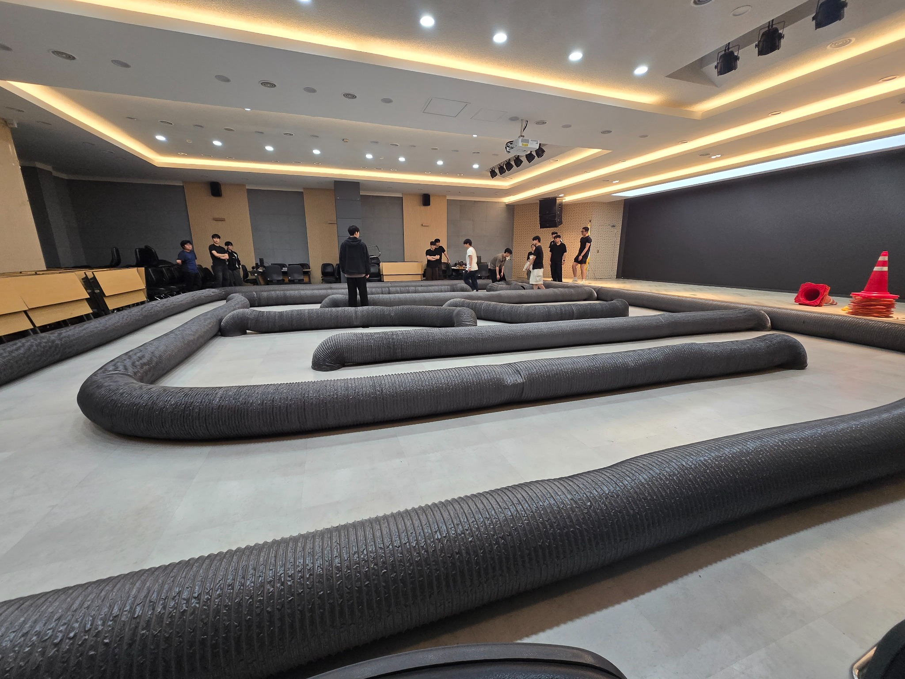
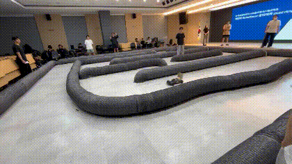
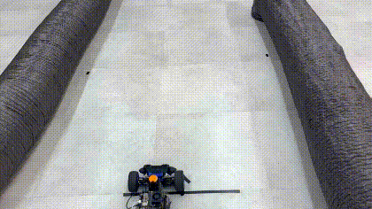
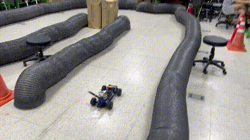
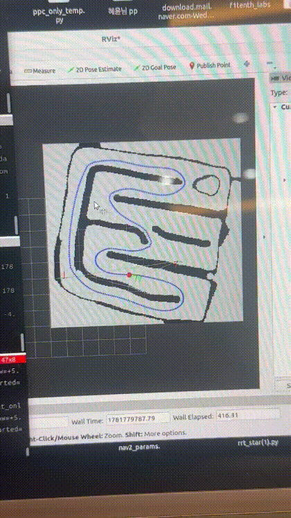
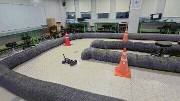
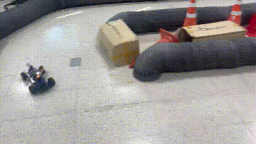
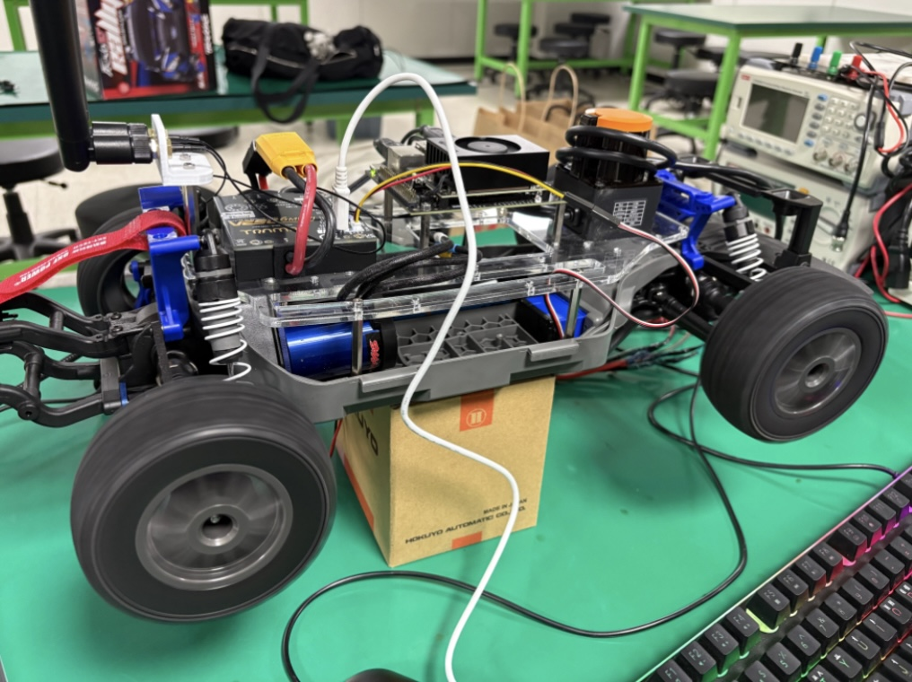

# F1TENTH Autonomous Driving Competition

> ROS 2 기반 F1TENTH 자율주행 차량에서 **Localization**, **Waypoint 기록**, **Pure Pursuit 경로 추종**, **LiDAR 기반 Gap Following 장애물 회피**를 구현하고 실제 차량 및 시뮬레이션 환경에서 검증한 프로젝트입니다.

본 저장소는 포트폴리오 공개용으로 정리한 버전입니다. 빌드 산출물(`build/`, `install/`, `log/`)과 중복 실험 파일은 제거하고, 실제 사용한 핵심 코드·맵·waypoint·시연 자료만 남겼습니다.

---



---

## Competition Demonstration

실제 대회 환경에서 F1TENTH 차량을 주행시키며 전체 시스템을 검증한 영상입니다. 아래 GIF를 클릭하면 원본 MP4 영상을 볼 수 있습니다.

[](media/demos/competition_demo.mp4)

---

## Pure Pursuit Path Tracking

Waypoint 기반 경로 추종 알고리즘입니다. 차량의 현재 위치를 `map -> base_link` TF로 받아 가장 가까운 waypoint를 찾고, 속도에 따라 lookahead 거리를 동적으로 조정하여 목표점을 선택합니다. 경로 곡률과 조향각을 함께 고려해 코너에서 감속하고 직선에서 속도를 회복하도록 구성했습니다.

### Pure Pursuit - Competition Track

[](media/demos/pure_pursuit_competition.mp4)

### Pure Pursuit - Practice Track

[](media/demos/pure_pursuit_practice.mp4)

**주요 구현 포인트**

- 동적 lookahead 거리 계산
- 곡률 기반 속도 제어
- 조향각 rate limit 및 smoothing
- waypoint, target point, lookahead line, steering arc RViz visualization
- `/drive` 토픽을 통한 `AckermannDriveStamped` 제어

대표 코드: [`projects/pure-pursuit/pure_pursuit/pure_pursuit_node.py`](projects/pure-pursuit/pure_pursuit/pure_pursuit_node.py)

---

## Localization / Nav2 Minimal Stack

Nav2 전체 스택을 모두 사용하기보다, 실험에 필요한 `map_server`, `amcl`, `planner_server`, `lifecycle_manager` 중심의 경량 구성으로 localization과 global planning을 검증했습니다. F1TENTH는 omnidirectional platform이 아니므로 AMCL motion model은 `nav2_amcl::DifferentialMotionModel` 기준으로 정리했습니다.

[](media/demos/localization_demo.mp4)

**주요 구현 포인트**

- AMCL 기반 pose estimation
- map server를 통한 occupancy grid 사용
- Global costmap 및 planner server 분리 실행
- RViz에서 map, LiDAR scan, estimated pose 정합 확인

관련 코드 및 설정: [`projects/nav2-minimal-stack`](projects/nav2-minimal-stack)

---

## Gap Following / Disparity Extension

LiDAR scan 데이터를 전처리한 뒤, 차량 폭과 안전 여유를 반영하여 장애물 주변을 확장하고 가장 안전한 gap을 선택하는 reactive obstacle avoidance 알고리즘입니다. 단순히 가장 먼 점을 따라가는 방식이 아니라, disparity extension, safety bubble, wall avoidance, steering smoothing, speed control을 함께 적용했습니다.

### Gap Following - Obstacle Avoidance

[](media/demos/gap_follow_obstacle.mp4)

### Gap Following - Track Driving

[](media/demos/gap_follow_track.mp4)

**주요 구현 포인트**

- LiDAR preprocessing 및 FOV filtering
- Safety bubble 생성
- Disparity extension 기반 장애물 확장
- 가장 넓고 안전한 gap 중심 선택
- 직선 구간 속도 boost 및 코너 감속
- 벽 가까움 보정 및 RViz marker visualization

대표 코드: [`projects/gap-following/gap_following/gap_follow_node.py`](projects/gap-following/gap_following/gap_follow_node.py)

---

## Hardware Platform



- Platform: F1TENTH RC vehicle
- Control: Ackermann steering
- Sensor: 2D LiDAR, imu
- Middleware: ROS 2 Humble
- Visualization: RViz
- Main Language: Python 3.x

---

## System Architecture

### Pure Pursuit

```text
                Map
                 │
                 ▼
        AMCL Localization
                 │
                 ▼
          Waypoint Tools
                 │
                 ▼
          Pure Pursuit
                 │
                 ▼
     Ackermann Controller
                 │
                 ▼
         F1TENTH Vehicle
```

---

### Localization

```text
                Map
                 │
                 ▼
           Map Server
                 │
                 ▼
        AMCL Localization
                 │
                 ▼
     Current Vehicle Pose
```

---

### Gap Following

```text
             2D LiDAR
                 │
                 ▼
      LiDAR Preprocessing
                 │
                 ▼
     Disparity Extension
                 │
                 ▼
        Safety Bubble
                 │
                 ▼
       Best Gap Selection
                 │
                 ▼
   Steering & Speed Control
                 │
                 ▼
     Ackermann Controller
                 │
                 ▼
         F1TENTH Vehicle
```

## Repository Structure

```text
.
├── README.md
├── media/
│   ├── competition_track.jpg
│   ├── f1tenth_hardware.jpg
│   └── demos/
├── resources/
│   ├── maps/          # 공통 occupancy map 데이터
│   └── waypoints/     # waypoint 기록 결과
└── projects/
    ├── nav2-minimal-stack/
    ├── waypoint-tools/
    ├── pure-pursuit/
    └── gap-following/
```

맵 파일은 특정 알고리즘 폴더에 넣지 않고 `resources/maps`에 분리했습니다. Gap Following은 LiDAR reactive driving 알고리즘이고, map은 Nav2 localization 및 waypoint 기록/검증 과정에서 사용한 공통 자원에 가깝기 때문입니다.

---

## Projects

| Project | Description | Main Files |
|---|---|---|
| Nav2 Minimal Stack | AMCL, map server, planner server 중심의 경량 Nav2 구성 | `projects/nav2-minimal-stack/config/nav2_params.yaml` |
| Waypoint Tools | TF 기반 waypoint 기록 및 RViz marker 시각화 | `projects/waypoint-tools/src/` |
| Pure Pursuit | waypoint 기반 경로 추종 및 속도 제어 | `projects/pure-pursuit/pure_pursuit/pure_pursuit_node.py` |
| Gap Following | LiDAR 기반 reactive obstacle avoidance | `projects/gap-following/gap_following/gap_follow_node.py` |

---


## What I Focused On

이 프로젝트에서는 단순히 예제 코드를 실행하는 것보다, 실제 차량에서 안정적으로 주행시키기 위해 다음 문제를 집중적으로 다뤘습니다.

- 고속 직선 구간에서 조향 진동 줄이기
- 코너 진입 전 감속과 탈출 후 가속 타이밍 조정
- LiDAR 노이즈와 장애물 경계를 안정적으로 처리하기
- 좁은 통로에서 차량 폭과 safety margin을 고려한 gap 선택
- map, pose, waypoint, target point를 RViz에서 확인 가능한 형태로 시각화
- 실차 주행과 시뮬레이션 결과를 비교하며 파라미터 튜닝

---

## Notes

- `resources/maps`의 map 파일은 공통 자원으로 분리했습니다.
- Pure Pursuit의 waypoint 파일은 실행 편의를 위해 `projects/pure-pursuit/pure_pursuit/waypoints.csv`에도 포함했습니다.
- 공개용 저장소이므로 빌드 결과물과 중복 실험 코드는 제외했습니다.
